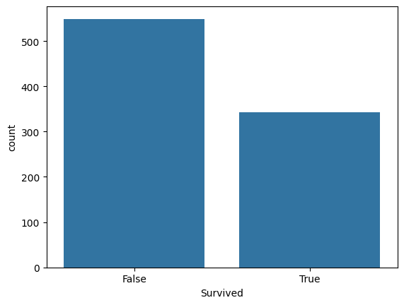

# Titanic Survival Analysis

## Project overview
An exploratory data analysis of the Titanic dataset to understand key factors that influenced passenger survival

# 1. Overall survival distribution

>only about 38% of passangers survived indicating a strong class imbalance
