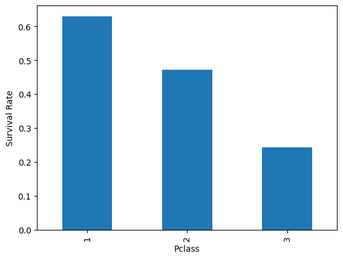
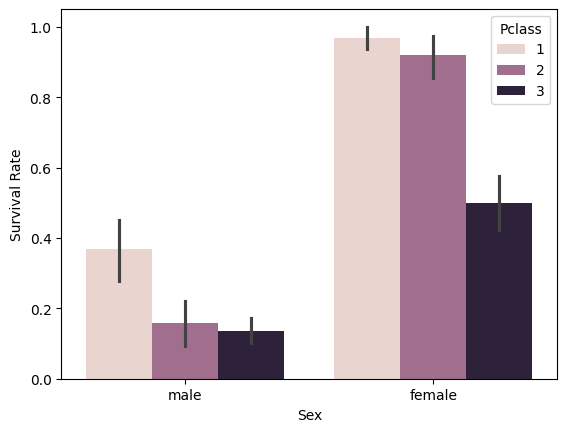
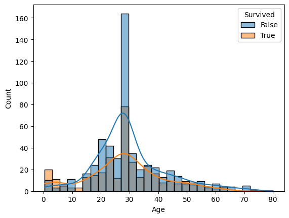

# Titanic Survival Analysis

## Project overview
An exploratory data analysis of the Titanic dataset to understand key factors that influenced passenger survival.

# 1. Overall survival distribution

only about 38% of passangers survived indicating a strong class imbalance.

# 2. Survival rate by gender

Female passangers had a significantly higher survival rate compared to males.

# 3. Survival rate by passanger class

Survival rate increased substantially with passanger class.

# 4. Survival rate by gender and class

First class women had the highest survival rate while third class men had the lowest survival rate.

# 5 Age distribution by survival status

Younger passengers showed higher survival likelihood.
